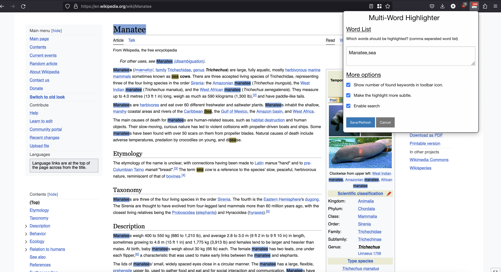

> This project is a modification of the Multi-Keywords Highlighter extension to **GitLab**: [project](https://github.com/ivanruvalcaba/multi-keywords-highlighter).

# Multi-Words Highlighter

Highlights given keywords on any web page you visit.

## Original Features
*Multi-Keywords Highlighter* is a browser extension for **Firefox** (*version 52.0 or higher*). It's intended to be assistive for searching for the interesting bits of a web page by defining a keyword list.

## Additonal Features
These are the additional features for a little more convenience.
- Random colors (each lightweights are random colors but with visibility)
- Enable and disable searching in the settings.

## Screen Cap

## Feedback
If you have any suggestion, comment or issue, please [create a new thread or participate in an existing one](https://github.com/ncrouzier/multi-search-highlighter/issues).

## Changelog

- *05/04/2025*: [version 1.0.5] Added search and clear buttons and shortcuts. Fixed list highlighting. Optimized when search is executed.
- *04/20/2025*: [version 1.0.4] Can now search list entries found in other list entries.
- *08/03/2023*: [version 1.0.3] New list format and highlights in list.
- *04/06/2023*: [version 1.0.2] Added shortcut option.
- *03/24/2023*: [version 1.0.0] Initial release.

## License

This software is distributed under the terms of the [GNU General Public License v3](https://www.gnu.org/licenses/gpl-3.0.en.html).

### Acknowledgements

The development of this extension was based on the following [project](https://github.com/wrzlbrmft/chrome-keywords-highlighter).
